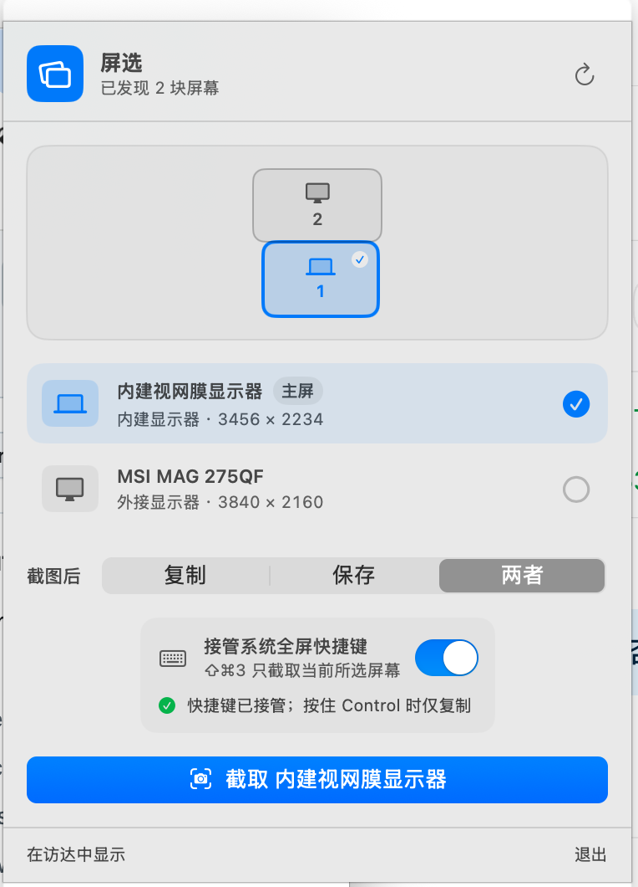

# 屏选 ScreenPick

Mac 多屏截图工具。先选屏幕，再截图，避免一次截出多张后再找图。



## 一键安装

要求：macOS 13 或更新版本。

第一次使用时，打开“终端”，复制下面整行并按回车：

```bash
cd ~/Desktop && git clone https://github.com/xinghe0709/ScreenPick.git ScreenPick && cd ScreenPick && ./Scripts/install.sh
```

安装脚本会自动完成构建、安装和打开应用。应用会被放到“应用程序”文件夹。

如果提示 `git: command not found`，先执行：

```bash
xcode-select --install
```

按提示安装完成后，再重新执行上面的一键安装命令。

如果提示 `destination path already exists`，说明项目已经下载过。执行：

```bash
cd ~/Desktop/ScreenPick && git pull && ./Scripts/install.sh
```

## 第一次使用

打开“系统设置 → 隐私与安全性 → 屏幕与系统音频录制”，打开“屏选”，然后退出并重新打开应用。

如果要使用“接管系统全屏快捷键”，再打开：

- “输入监控”里的“屏选”
- “辅助功能”里的“屏选”

屏选不显示在 Dock 中，打开后请看屏幕右上角的菜单栏。

## 使用

1. 点击菜单栏中的屏选图标。
2. 点选要截图的屏幕。
3. 选择“复制”“保存”或“两者”。
4. 点击蓝色截图按钮。

开启快捷键接管后，按 `Shift-Command-3` 也可以截取当前选中的屏幕。截图默认保存到“桌面/ScreenPick”。

## 常见问题

### 截图按钮不能点击

检查“屏幕与系统音频录制”里的“屏选”是否已打开，然后完全退出并重新打开应用。

### 菜单栏找不到屏选

屏选没有 Dock 图标，请看屏幕右上角的菜单栏。也可以重新打开“应用程序”里的屏选。

### 刚接上或拔掉一块屏幕

打开屏选后，点击右上角的刷新按钮。
